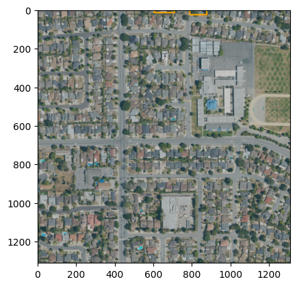
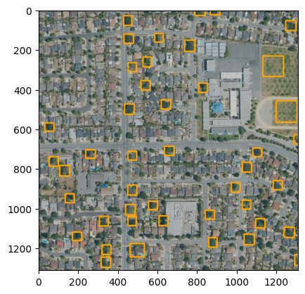

# San-Jose-Urban-Forest

## Problem
- The City of San Jose’s tree canopy has been shrinking at an alarming rate. From 2012 to 2018 the City lost 1,728 acres or 2.7 square miles.
- The City has limited data and resources to track its tree canopy.

## Solution
- Create a cost effective solution that will allow the City of San Jose to assess its tree canopy on a yearly basis using a Deep Learning model and available aerial imagery
- Calculate overall tree canopy coverage for any given aerial imagery dataset
- From aerial imagery, produce tree bounding boxes used to derive location information for individual trees and their canopy area coverage
- Convert the generated data to GeoJSON and Shapefile formats so that others, like city workers, can use the data on existing Geographic Information System (GIS) software

## Results
Results: 
- Using 2022 aerial imagery from the California Department of Fish and Wildlife, the fine tuned model had a 0.65 box recall
- Calculated the City of San Jose had 21,285 Acres of tree canopy
- Notable comparison: Google's Environmental Insights Explorer calculated the City of San Jose has 81 square kilometers (20,015.5 Acres) of tree canopy

  
  

